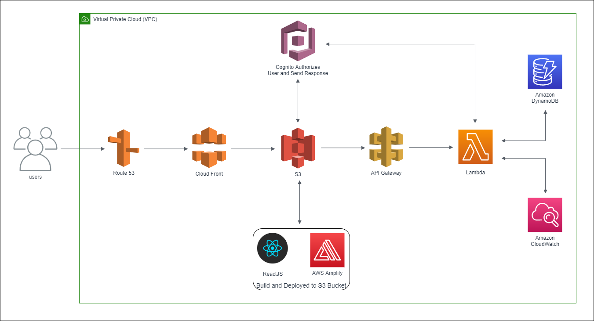
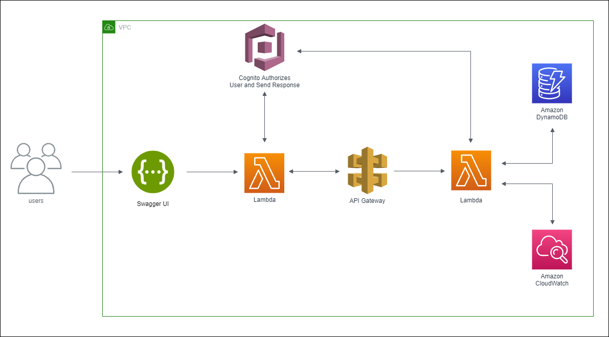

# `High Level Design 📄 of Psipher 🔐`
***
## `For Deployment Purpose`

##### This architecture is fully based on serverless model, hence there is very less maintenance cost and cost effective.

### Why these?
- **Route 53** - This is optional for our Psipher. Only use when you have a custom domain. It is used to map custom domain(example.com) to application domain(randomly generated). It is a highly available and scalable Domain Name System Service.

- **CloudFront** - Helps for content delivery. It also saves Psipher from any cyber attack. It has low latency and uses static caching to achieve it.
- **S3** - It is used for CI/CD for backend and frontend application.
- **AWS Amplify** - It is used to deploy react application and maintain authenticity of users. It is also highly scalable and helps to store data securely.
- **ReactJS** - This is used to build user interface (frontend). It is open source JavaScript Library.
- **Cognito** - This is for user authentication at both backend and frontend which include JWT.
- **API Gateway** - It takes all API calls from react application and route them to lambda handlers.
- **Lambda** - This is a serverless function in which our spring boot (backend) application resides.
- **DynamoDB** - DynamoDB is a serverless DB in which user data is stored.
- **CloudWatch** - Used for metric and log monitoring.
- **VPC** - It helps Psipher components to establish a logical isolated section from users.

***

## `For Testing Purpose`

- **SwaggerUI** - Used for API testing and documentation for our backend. This resides on Lambda.
