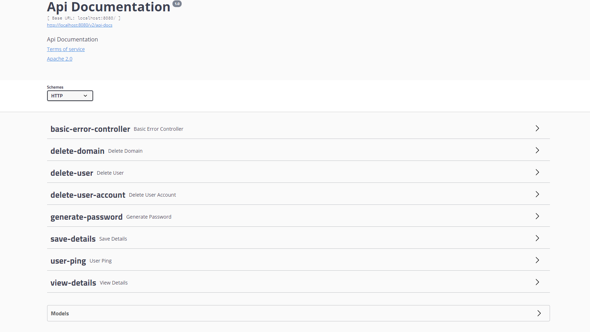

# Psipher Backend Testing using Swagger - UI 🔨

### To view API documents locally.
1. Run the backend application in terminal

    For Linux or PowerShell

    ```
    ./mvnw spring-boot:run
    ```

    For Command Prompt

    ```
    .\mvnw spring-boot:run
    ```

2. Open the localhost in your browser

    ```
    http://localhost:8080/swagger-ui.html
    ```

3. Please choose appropriate Schemes i.e. HTTP or HTTPS.

4. Now you can read the API documentation, view Models and examples for the API.

  
---

### To execute the deployed API on AWS
1. Run the backend application in terminal and pass the URL as command line argument.

    For Linux or PowerShell (Sample Code Line)

    If your URL looks like this -> `https://google.com` paste only -> `google.com` in your terminal.

    ```
    ./mvnw spring-boot:run -Drun.arguments=--swaggerurl=xeerdfs687.execute-api.us-west.amazonaws.com/Stage
    ```

    For Command Prompt (Replace your-url-here with original URL)

    ```
    .\mvnw spring-boot:run -Drun.arguments=--swaggerurl=your-url-here
    ```

2. CORS Unblock - Make sure the CORS works fine with your browser, you can download the plugin/extension. Please test CORS before moving ahead. To test CORS, you can use the extension test feature. For Chrome -> [Click Here](https://chrome.google.com/webstore/detail/cors-unblock/lfhmikememgdcahcdlaciloancbhjino?hl=en).

3. Open the localhost in your browser and check the base URL. If it is your AWS URL then you are good to move ahead.

4. Now, choose the appropriate Schemes (Here use "https").

5. Now you can test the API's by clicking on try it out button. You can also view the example value, description, and select Parameter content type.
